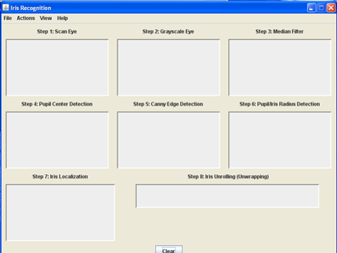
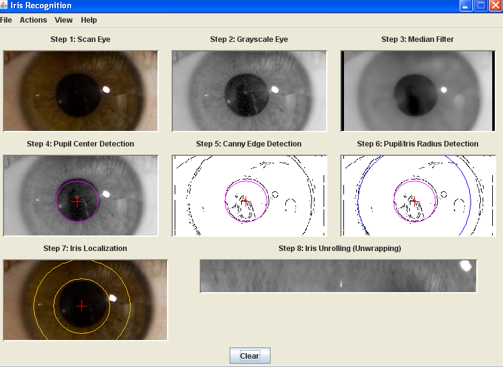
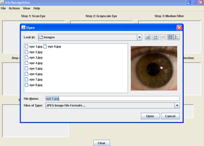

<h1 align="center">👁️ Iris Recognition & Biometric Authentication System</h1>

<p align="center">
A professional <b>biometric authentication system</b> developed using Java and image processing techniques for secure identity verification through iris pattern recognition.
</p>

<p align="center">


</p>

---

# 🚀 Project Overview

This project implements a **biometric iris recognition system** that analyzes unique iris textures to verify identity.

It follows a complete computer vision pipeline including preprocessing, segmentation, normalization, feature extraction, and matching using Hamming Distance.

The system is built using **Java Swing for GUI** and advanced **image processing techniques**, making it suitable for secure authentication applications.

---

## 🎯 Key Highlights

- 👁️ Iris-based biometric authentication system  
- 🧠 Computer Vision + Image Processing pipeline  
- ⚙️ Feature extraction using Wavelet Packet Decomposition  
- 🔐 Secure matching using Hamming Distance  
- 🖥️ Interactive Java Swing GUI  
- 📊 End-to-end recognition workflow  

---

## 💡 Purpose of the Project

The main goal of this system is to demonstrate how biometric authentication works using iris patterns, which are highly unique and stable for every individual.

It helps in understanding:
- Real-world biometric security systems  
- Image processing pipelines  
- Pattern recognition techniques  
- Feature extraction and matching algorithms  


---

# 🏗️ System Architecture

The application follows a structured biometric authentication workflow:

```text
Input Eye Image
        ↓
Image Preprocessing
        ↓
Iris Segmentation
        ↓
Edge Detection
        ↓
Boundary Detection
        ↓
Normalization (Polar Transformation)
        ↓
Feature Extraction
        ↓
Iris Code Generation
        ↓
Pattern Matching
        ↓
Authentication Result
````

---

# ✨ Key Features

## 🔹 Image Preprocessing

* Grayscale conversion
* Noise filtering
* Contrast enhancement
* Image optimization for accurate recognition

## 🔹 Iris Segmentation

* Detection of iris and pupil boundaries
* Isolation of iris region from eye image
* Circular boundary localization

## 🔹 Edge Detection

* Canny Edge Detection implementation
* Improved iris boundary identification
* Noise-resistant detection mechanism

## 🔹 Iris Normalization

* Polar coordinate transformation
* Iris unwrapping process
* Standardized iris representation

## 🔹 Feature Extraction

* Wavelet Packet Decomposition (WPD)
* Texture-based iris feature encoding
* Efficient iris pattern representation

## 🔹 Iris Matching

* Binary iris code generation
* Similarity comparison using Hamming Distance
* Secure biometric verification mechanism

## 🔹 Graphical User Interface

* Java Swing-based desktop interface
* Interactive authentication workflow
* Simple and user-friendly navigation

---

# 🧠 Technologies Used

| Category             | Technology                   |
| -------------------- | ---------------------------- |
| Programming Language | Java                         |
| GUI Framework        | Java Swing                   |
| Image Processing     | Computer Vision Techniques   |
| Edge Detection       | Canny Algorithm              |
| Feature Extraction   | Wavelet Packet Decomposition |
| Matching Algorithm   | Hamming Distance             |
| Development Concepts | OOP, Event Handling          |

---

# 📂 Project Structure

```text
IrisRecognitionSystem/
│
├── SourceCode/
│   ├── GUI/
│   ├── ImageProcessing/
│   ├── Segmentation/
│   ├── FeatureExtraction/
│   ├── Matching/
│   └── Utilities/
│
├── Dataset/
│   └── EyeImages/
│
├── Documentation/
│   ├── ProjectReport/
│   └── ReferenceMaterials/
│
├── assets/
│   └── screenshots/
│       ├── login_screen.png
│       ├── Iris_Workflowg.png
│       └── Matching_Iris.png
│
├── run.bat
├── README.md
└── .gitignore
```

---

# 📸 Application Screenshots

## 🔹 Authentication Interface

<p align="center">

</p>

---

## 🔹 Iris Processing & Segmentation

<p align="center">

</p>

---

## 🔹 Authentication Result

<p align="center">

</p>

---

# 🔄 Working Process

## Step 1 — Image Acquisition
The system begins by accepting a raw eye image as input. This image can be captured from a dataset or external source. It serves as the foundation for the entire biometric recognition pipeline. The quality of this image directly impacts the accuracy of the recognition process.

## Step 2 — Image Preprocessing
In this step, the input image is preprocessed to enhance its quality and remove unwanted noise. The image is converted into grayscale to simplify computation and improve processing efficiency. Filtering techniques are applied to reduce noise and enhance important features such as edges and intensity variations.

## Step 3 — Iris Segmentation
The system isolates the iris region from the rest of the eye image. Using boundary detection techniques, the pupil and outer iris boundaries are identified. This step ensures that only the relevant biometric region is extracted for further processing, eliminating unnecessary background information.

## Step 4 — Edge Detection
Canny Edge Detection is applied to identify sharp intensity changes in the image. These edges help in accurately locating the iris boundaries. This step plays a crucial role in improving the precision of segmentation by detecting fine structural details.

## Step 5 — Iris Normalization
The segmented iris, which is circular in shape, is transformed into a fixed rectangular representation using polar coordinate transformation. This process is known as iris unwrapping. It ensures consistency in iris representation regardless of size, distance, or pupil dilation.

## Step 6 — Feature Extraction
Once the iris is normalized, unique texture patterns are extracted using Wavelet Packet Decomposition. This technique captures both frequency and spatial information from the iris image, making it highly suitable for biometric feature representation.

## Step 7 — Iris Code Generation
The extracted features are converted into a binary iris code. This compact representation encodes the unique characteristics of an individual’s iris, making it efficient for storage and comparison.

## Step 8 — Matching Process
The generated iris code is compared with stored templates in the database using Hamming Distance. This metric calculates the similarity between two binary patterns and determines how closely they match.

## Step 9 — Authentication Decision
Based on the matching score, the system determines whether the user is authenticated or rejected. A threshold value is used to decide if the similarity is sufficient for a successful match.

---

# 🚀 Applications

This project can be used in:

* Biometric Authentication Systems
* Banking Security Systems
* Secure Access Control
* Government Identification Systems
* Smart Surveillance Systems
* Attendance Management Systems
* Airport & Border Security

---

# 🔐 Security Advantages

* ✔️ Highly accurate biometric identification
* ✔️ Difficult to duplicate iris patterns
* ✔️ Improved security over password systems
* ✔️ Contactless authentication mechanism
* ✔️ Reliable identity verification process

---

# 📈 Future Enhancements

The system can be enhanced further with:

* 🔹 Real-time camera integration
* 🔹 Deep learning-based iris recognition
* 🔹 Cloud database connectivity
* 🔹 AI-based feature optimization
* 🔹 Mobile authentication support
* 🔹 MySQL database integration
* 🔹 Multi-user biometric management
* 🔹 REST API integration

---

# 🧪 Concepts Implemented

* Image Processing
* Computer Vision
* Pattern Recognition
* Biometric Authentication
* Feature Engineering
* Object-Oriented Programming
* GUI Development
* Secure Authentication Systems

---

# ▶️ How to Run

## Step 1 — Clone Repository

```bash
git clone https://github.com/SristyP22/IrisRecognitionSystem.git
```

## Step 2 — Open Project

Open the project in:

* IntelliJ IDEA
* Eclipse
* NetBeans

## Step 3 — Compile Project

```bash
javac Main.java
```

## Step 4 — Run Application

```bash
java Main
```

---

# 👩‍💻 Developer

## Sristy Pandey

MCA Gold Medalist | Programmer | Computer Vision & AI Enthusiast

* 🔗 GitHub: [https://github.com/SristyP22](https://github.com/SristyP22)
* 💼 LinkedIn: [https://www.linkedin.com/in/sristy-pandey-b008922b9](https://www.linkedin.com/in/sristy-pandey-b008922b9)
* 🧠 HackerRank (5⭐ Java & Python): [https://www.hackerrank.com/profile/pandeysristy910](https://www.hackerrank.com/profile/pandeysristy910)

---

# ⭐ Repository Highlights

* ✔️ Clean project structure
* ✔️ Professional documentation
* ✔️ GUI-based biometric system
* ✔️ Real-world authentication workflow
* ✔️ Computer vision implementation

---

# 📜 License

This project is developed for educational, academic, demonstration purposes.

---

# 🌟 Support

If you found this project useful, consider giving it a ⭐ on GitHub.

---
